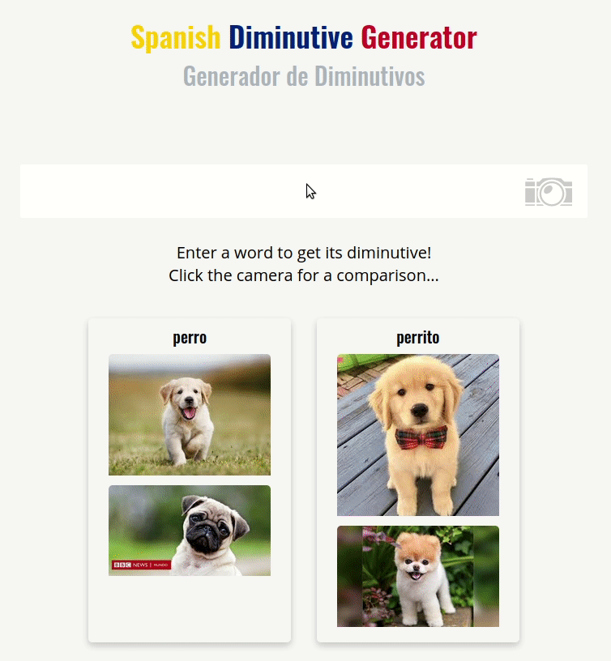

# spanish-diminutive-generator

The Spanish Diminutive Generator or 'generador de diminutivos'...
Input a word (like 'casa' or 'café') and get its Spanish diminutive version (like 'casita' or 'cafecito').

## User Stories Goals
Simple search box centered in the page.
Current and stretch goals for the project:
- Enter a word, hit submit, and get your final diminutive form
- As a user types, they should receive autocomplete suggestions
- Stretch: add a tool-tip for the words that vary by region (eg. papá can be papito or papacito, pan can be pancito or panecito)
- Stretch: Add before and after images using Google (or Unsplash's, or anyone's) API to emphasize the diminutive form. (eg. enter 'gato' to receive 'gatito', the left side of the screen will show image results for gato, the right side of the screen will show image results for a tiny, little cat or 'gatito')

## Noted words to update support for
Some of these words can be hard-coded, but I´m going to review which don't need to be.
Word | Correct Diminutive | What the Generator Produces
feo/fea | feito/feita | feecito
nuevo | nuevecito | nuevito
taza | tacita | tazita
plaza | placita | plazita

## Technical
React app

## Contributor's Guide
At this time, no additional functionality needs have been laid out. If you'd like to get in touch, you can reach me via my website, http://coreyhodge.net